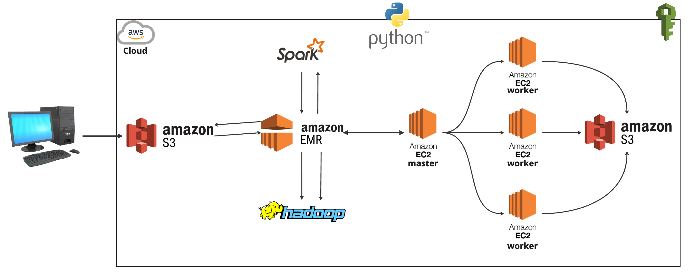

# NYC Taxi Analytics: Spark ETL Pipeline on AWS EMR

## Project Summary

This project demonstrates the use of Amazon Elastic Map Reduce (EMR) for processing NYC taxi trip data using Apache Spark. It includes a Spark script for ETL (Extract, Transform, Load) operations, SSH command references for connecting to the EMR cluster, and sample Spark job submission commands.

## Architecture



- **S3**: Source and destination storage
- **EMR**: Managed Spark cluster
  - Master node coordinates jobs
  - Worker nodes execute processing in parallel
- **PySpark**: Processing framework for transformation logic

## Files

- `spark-etl.py`: Reads data from an input directory, adds a timestamp, and writes the result to an output directory in Parquet format
- `commands.py`: Contains reference SSH commands for connecting to EMR cluster and examples of Spark job submission commands
- `tripdata.csv`: Sample NYC taxi data (20,000 records) for testing and demonstration

## Usage

1. **Connect to EMR cluster**
   ```bash
   ssh -i [key-pair] hadoop@[emr-master-public-dns-address]
   ```

2. **Submit Spark job locally on EMR**
   ```bash
   spark-submit spark-etl.py s3://<YOUR-BUCKET>/input/ s3://<YOUR-BUCKET>/output/spark
   ```

3. **Submit Spark job directly from S3**
   ```bash
   spark-submit s3://<bucketname>/files/spark-etl.py s3://<bucketname>/input s3://<bucketname>/output
   ```

## Output

- Transformed data in Parquet format
- Added timestamp column
- Schema and record count information printed

## Requirements

- Apache Spark
- AWS CLI
- An AWS account with necessary permissions to create and manage EMR clusters
- SSH key pair for EMR access

## Conclusion

This ETL pipeline demonstrates a serverless approach to big data processing, leveraging AWS managed services to handle scalable workloads. The architecture can be easily extended to accommodate larger datasets, additional transformations, or integration with data warehousing solutions for analytics.
